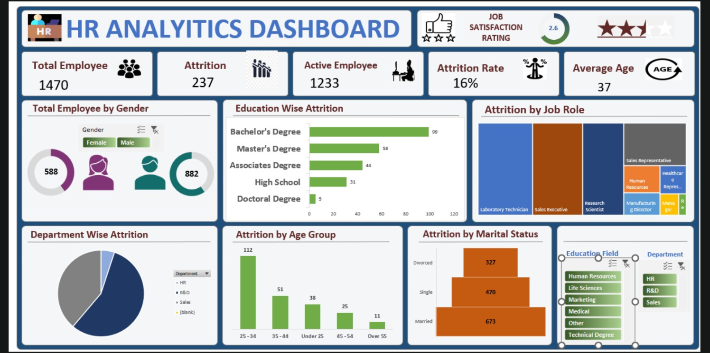

# 👨‍💼 HR Analytics Dashboard

## 📌 Project Overview

The HR Analytics Dashboard is an interactive Excel-based dashboard designed to analyze employee attrition patterns and workforce demographics. It provides actionable insights into employee turnover, job satisfaction, age distribution, education background, and departmental performance.

The dashboard helps HR teams identify key factors contributing to attrition and supports data-driven workforce management decisions.

---

## 🎯 Business Objective

The primary objective of this project is to:

- Monitor employee attrition trends
- Analyze workforce demographics
- Identify high-risk employee segments
- Improve employee retention strategies
- Support HR decision-making through data visualization

---

## 📊 Dashboard Highlights

✅ Total Employees Tracking

✅ Attrition & Attrition Rate Analysis

✅ Active Employee Monitoring

✅ Job Satisfaction Rating

✅ Gender Distribution Analysis

✅ Department-wise Attrition Analysis

✅ Job Role-wise Attrition Analysis

✅ Education-wise Attrition Analysis

✅ Age Group Analysis

✅ Marital Status Analysis

✅ Interactive Filters & Slicers

---

## 🛠️ Tools & Skills Used

- Microsoft Excel
- Data Cleaning
- Data Analysis
- Pivot Tables
- Pivot Charts
- Slicers
- Conditional Formatting
- Dashboard Design
- HR Analytics
- Data Visualization

---

## 📈 Key Insights

- Total Employees: 1470
- Attrition Count: 237
- Attrition Rate: 16%
- Active Employees: 1233
- Average Employee Age: 37 Years

### Key Findings

- Employees aged 25–34 show the highest attrition.
- Research Scientists, Sales Executives, and Laboratory Technicians contribute significantly to employee turnover.
- Employees with Bachelor's Degrees account for the largest share of attrition.
- Attrition patterns vary across departments and job roles.
- Workforce demographics reveal valuable trends for retention planning.

---

## 🚀 Project Outcome

This dashboard enables HR professionals to identify attrition trends, understand employee demographics, and make informed decisions to improve workforce retention and organizational performance.

---

### 📷 Dashboard Preview

---

⭐ If you found this project useful, feel free to explore the repository and share your feedback!
